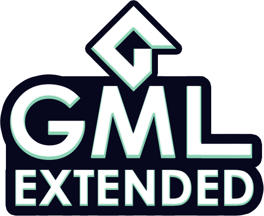
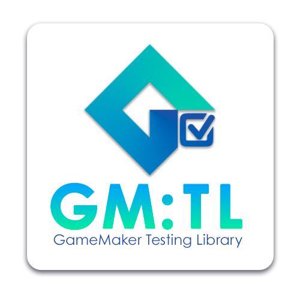

<!--

-->

---

## Working On My Dream Project

<iframe width="600" height="300" src="https://www.youtube.com/embed/dJ1ga67zW-0"></iframe>

 

---

## ✨ Open-Source Projects I'm Proud Of ✨

<table align="center">
    <tr>
        <td align="right"></td>
        <td><a href="https://github.com/DAndrewBox/GML-Extended">GML Extended</a> A GameMaker extension to complement GameMaker built-in functions and make your life easier.</td>
	    <td align="right"></td>
        <td><a href="https://github.com/DAndrewBox/GM-EzConsole">EzConsole</a> A GameMaker Studio 2.3+ extension that adds a customizable debug console to your game.</td>
    </tr>
    <tr>
	    <td align="right"></td>
        <td><a href="https://github.com/DAndrewBox/GM-dotEnv">GM.env</a> A library that loads environment variables from a .env file into GameMaker based on JS.dotenv.</td>
        <td align="right"></td>
        <td><a href="https://github.com/DAndrewBox/GM-Testing-Library">GM.env</a> An open-source testing framework for GameMaker with a focus on simplicity and ease of use.</td>
    </tr>
</table>

